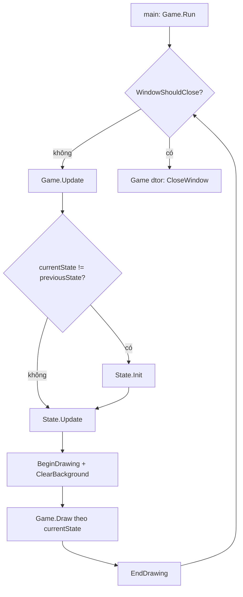
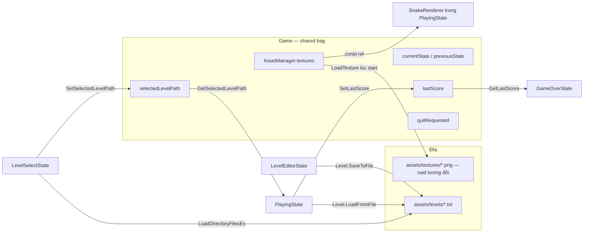
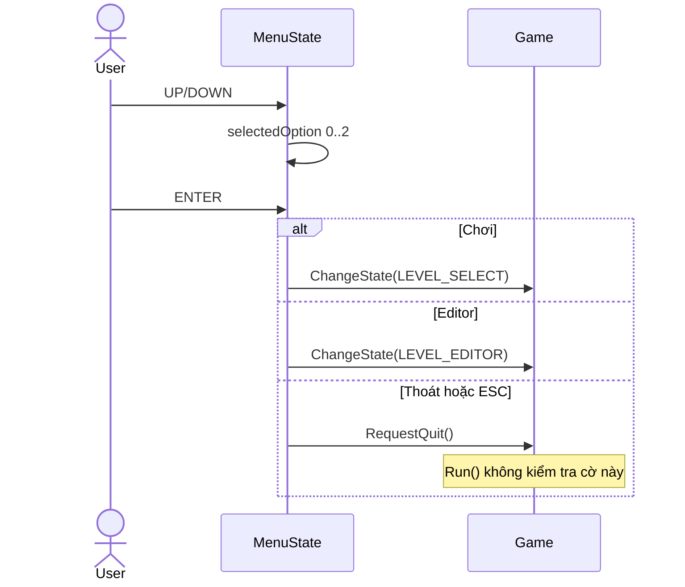
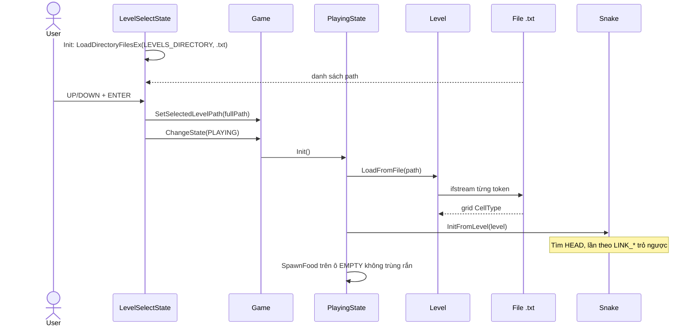
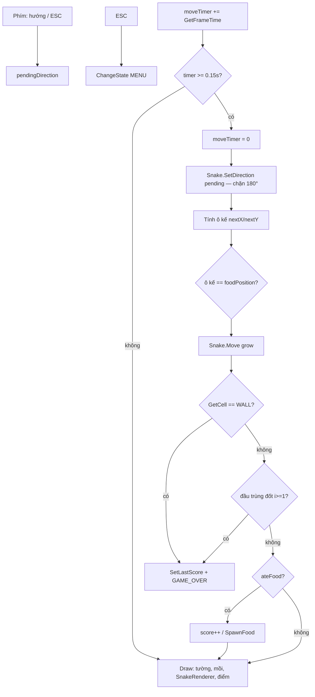
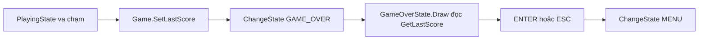
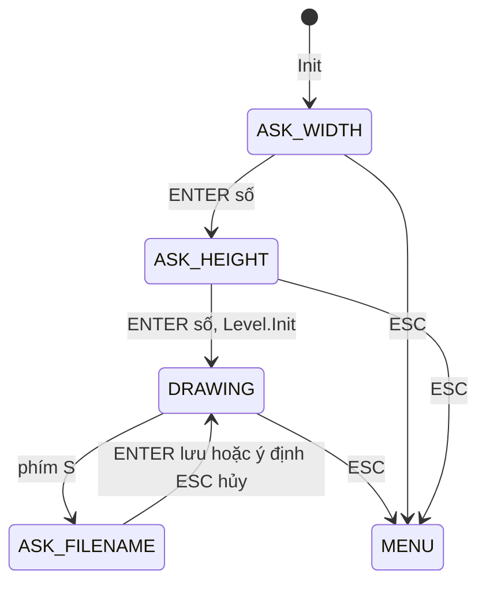
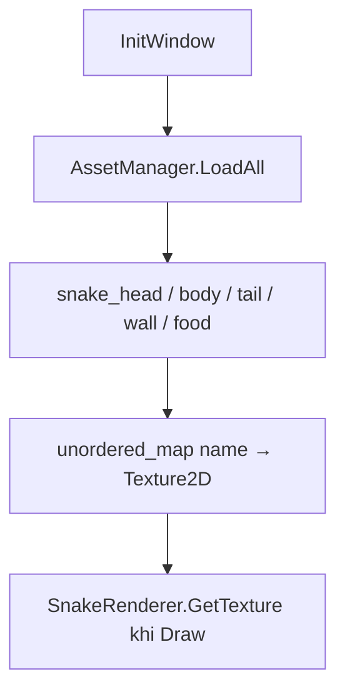

# Luồng dữ liệu

Dự án là game local: “request” = input (bàn phím/chuột) mỗi frame. Không có HTTP, session server, hay DB. Sơ đồ dưới map tạm sang layer quen thuộc:

| Layer web điển hình | Tương đương trong Snake |
|---------------------|-------------------------|
| Controller | `*State::Update()` (đọc input, quyết định chuyển scene) |
| Service | `Snake`, `PlayingState` (ăn mồi, va chạm, spawn) |
| Repository | `Level::LoadFromFile` / `SaveToFile`, `LoadDirectoryFilesEx` |
| View | `*State::Draw()`, `SnakeRenderer` |
| Shared store | Member của `Game` |

---

## 1. Vòng lặp frame (luồng tổng)

`Game::ChangeState` chỉ gán `currentState`. `previousState` được cập nhật **cuối** `Update()`, nên `Init()` chạy đúng một lần khi vừa vào state (trừ lần vào MENU đầu tiên: `currentState == previousState == MENU` → `MenuState::Init()` **không** chạy lúc launch; giá trị mặc định vẫn đúng).

`quitRequested` được set từ menu nhưng **không** được `Run()` đọc — đóng cửa sổ vẫn chỉ qua nút X / `WindowShouldClose`.

---

## 2. Nơi lưu và truyền state

### Bảng state

| Dữ liệu | Nơi sống | Ai ghi | Ai đọc | Thời gian sống |
|---------|----------|--------|--------|----------------|
| `currentState` | `Game` | Mọi state qua `ChangeState` | `Game::Update/Draw` | Cả phiên |
| `selectedLevelPath` | `Game` | `LevelSelectState` (full path). Default ctor: `"level1.txt"` (không có thư mục, file này không có trong repo) | `PlayingState::Init` | Cho đến khi chọn màn khác |
| `lastScore` | `Game` | `PlayingState` trước Game Over | `GameOverState::Draw` | Cho đến ván sau ghi đè |
| `quitRequested` | `Game` | `MenuState` | **Không ai** | — |
| Texture GPU | `AssetManager` trong `Game` | `LoadAll()` một lần | `SnakeRenderer` | Đến khi destroy `Game` |
| Lưới level | `Level` trong Playing hoặc Editor | Load file / SetCell / Init | Draw, Snake::InitFromLevel, va chạm, spawn mồi | Theo state object (không reset khi rời scene trừ lần `Init` kế) |
| Đốt rắn | `Snake::segments` | Init / Move | Renderer, OccupiesCell, collision | Trong `PlayingState` |
| `pendingDirection` | `PlayingState` | Phím mũi tên mỗi frame | `SetDirection` lúc step | Một nhịp di chuyển |
| `foodPosition`, `score`, `moveTimer` | `PlayingState` | SpawnFood / ăn / GetFrameTime | Update/Draw | Một ván |
| `levelFiles`, `selectedIndex` | `LevelSelectState` | `Init()` quét thư mục | Update/Draw | Mỗi lần vào select |
| Editor: `phase`, `inputBuffer`, `currentBrush`, `hasHead` | `LevelEditorState` | Input | Update/Draw | Phiên editor |

Không có: Redux/Context, cookie, session HTTP, thread khác, queue mạng.

Input raylib (`IsKeyPressed`, `GetMousePosition`) là **trạng thái frame hiện tại**, không lưu.

---

## 3. Luồng nghiệp vụ

Không có auth/payment. Các luồng quan trọng:

### 3.1 Menu → chọn hành động

### 3.2 Chọn màn → chơi

Đường levels: `PROJECT_SOURCE_DIR "assets/levels"` (source tree), **không** bản copy trong `build/`. Texture vẫn đọc `assets/textures/` theo **cwd** (thường là cạnh exe sau POST_BUILD copy).

### 3.3 Một bước gameplay (input → logic → render)

- Mồi: `GetRandomValue` trên danh sách ô trống. Hết ô → `SpawnFood` return, `foodPosition` có thể giữ giá trị cũ hoặc `-1,-1`.
- Tường ngoài lưới: `Level::GetCell` trả `WALL` → chết khi đi ra ngoài.
- Ô `HEAD`/`LINK_*` còn trên lưới **không** phải tường; rắn đi xuyên “dấu vết file”. Mồi không spawn trên các ô đó vì không `EMPTY`.

### 3.4 Thua → Game Over → Menu

Điểm **không** ghi ra đĩa (`note` đã ghi thiếu lưu điểm).

### 3.5 Level Editor → file

Lưu:

1. `fullPath = LEVELS_DIRECTORY + "/" + tên + ".txt"`
2. `Level::SaveToFile`: tạo thư mục cha nếu thiếu → ghi token (`0`, `WALL`, `HEAD`, `LINK_*`)
3. `lastSaveMessage` chỉ trên UI editor

Chuột trái: `SetCell` theo brush. Chuột phải: xóa EMPTY. Brush HEAD bị chặn nếu `hasHead`.

Level Select lần vào sau sẽ quét lại thư mục → thấy file mới **không** cần rebuild (đúng ý comment trong `Constants.h`).

### 3.6 Asset load (khởi động)

Load fail (`id == 0`): log stderr, vẫn insert map → vẽ texture rỗng. Không abort.

---

## 4. Format file level (hợp đồng dữ liệu)

- Mỗi dòng = một hàng; token phân tách khoảng trắng.
- `StringToCell` token lạ → `EMPTY` (nuốt lỗi).
- `width` = độ dài **hàng đầu**; hàng ngắn hơn vẫn được đẩy vào `grid` (rủi ro OOB — xem `BUGS_AND_ISSUES.md`).
- Rắn lúc chơi **không** cập nhật lại file; file chỉ là spawn layout.

Ví dụ repo (`assets/levels/test.txt`): khung `WALL`, một `HEAD`, không `LINK_*` → rắn 1 đốt, hướng mặc định `RIGHT` nếu không suy ra từ đốt 2.
